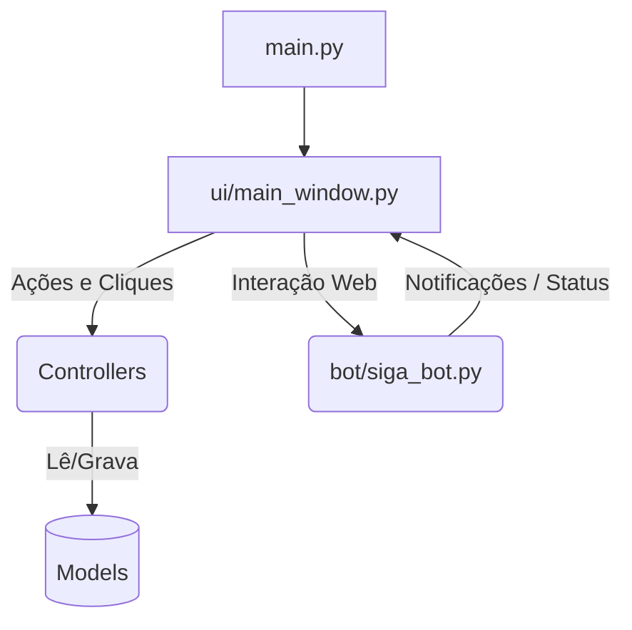

# Arquitetura do AutoSIGA

Bem-vindo ao guia arquitetural do **AutoSIGA**. Este documento foi desenhado para ajudar novos programadores a entender como o código-fonte está organizado após a grande refatoração de maio de 2026.

## 🏗️ Padrão Adotado: MVC (Model-View-Controller) Adaptado

O projeto originalmente era um arquivo monolítico de mais de 1.400 linhas. Agora, ele adota o padrão **MVC**, separando responsabilidades lógicas, de interface e de automação web.



### 1. Models (Acesso a Dados e Persistência)
Localizado na pasta `/models`, abriga classes que lidam exclusivamente com I/O (Input/Output). Nenhum Model sabe o que é uma janela ou um clique.
- **`config_manager.py`**: Acessa e edita o `config.json`.
- **`ofx_reader.py`**: Traduz arquivos físicos `.ofx` para dicionários nativos do Python usando a biblioteca `ofxparse`.

### 2. Controllers (Lógica de Negócios)
Localizado em `/controllers`, contém a inteligência de processamento matemático e expurgo.
- **`conciliador.py`**: Pega a lista do banco (Model) e a lista do HTML (SigaBot) e compara uma com a outra com tolerância de até 1 centavo, identificando o que precisa ser lançado.
- **`exportador.py`**: Expurga palavras-chave (ex: "RESG.") e converte uma lista de transações em um arquivo `.txt` formatado em padrão ASP Brasileiro (separador por ponto e vírgula).

### 3. Bot (Automação / Headless)
Localizado em `/bot`. Devido à natureza robusta e assíncrona do Playwright, a automação ganhou um módulo exclusivo.
- **`siga_bot.py`**: Um esqueleto autônomo. Ele faz o bypass de campos complicados (Select2) e injeta dados.
  > **🚨 IMPORTANTE**: O Bot roda numa *Thread Paralela*. Ele se comunica com a Interface Gráfica através de **Callbacks** para não congelar o sistema operacional do usuário.

### 4. View (Interface Gráfica)
Localizado em `/ui`.
- **`main_window.py`**: É o antigo arquivo gigante, agora purgado de regras de negócio. Usa o `CustomTkinter` para renderizar uma interface limpa.
- **Thread-Safety**: Todo acesso à UI vindo do Bot passa pelo método `self.after(0, ...)`, garantindo que apenas a *Main Thread* pinte os pixels na tela.

## 🚀 Como Iniciar

O ponto de entrada absoluto do projeto é o `main.py` na raiz. 
Para rodar, basta ativar sua `venv` e executar:
```bash
python main.py
```

## 🛠️ Build do Executável

Sempre que criar uma versão nova para os usuários finais rodarem no Windows sem instalarem Python, utilize o PyInstaller apontando para o `main.py`:
```bash
pyinstaller --noconfirm --onedir --windowed --add-data "venv/Lib/site-packages/customtkinter;customtkinter" main.py
```
